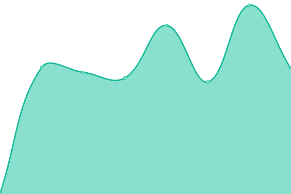

# [📈 Live Status](https://W4L33D.github.io/DGIURLs): <!--live status--> **🟩 All systems operational**

This repository contains the open-source uptime monitor and status page for [W4L33D](https://W4L33D.github.io/DGIURLs), powered by [Upptime](https://github.com/upptime/upptime).

With [Upptime](https://upptime.js.org), you can get your own unlimited and free uptime monitor and status page, powered entirely by a GitHub repository. We use [Issues](https://github.com/W4L33D/DGIURLs/issues) as incident reports, [Actions](https://github.com/W4L33D/DGIURLs/actions) as uptime monitors, and [Pages](https://W4L33D.github.io/DGIURLs) for the status page.

<!--start: status pages-->
<!-- This summary is generated by Upptime (https://github.com/upptime/upptime) -->
<!-- Do not edit this manually, your changes will be overwritten -->
<!-- prettier-ignore -->
| URL | Status | History | Response Time | Uptime |
| --- | ------ | ------- | ------------- | ------ |
|  [AnsattPortal](https://ansattportal.dgi.no/) | 🟩 Up | [ansatt-portal.yml](https://github.com/W4L33D/DGIURLs/commits/HEAD/history/ansatt-portal.yml) | 

 1697ms
     
 | 

<a href="https://W4L33D.github.io/DGIURLs/history/ansatt-portal">100.00%</a>
    

|  [Gardemoregionen](https://gardermoregionen.no/) | 🟩 Up | [gardemoregionen.yml](https://github.com/W4L33D/DGIURLs/commits/HEAD/history/gardemoregionen.yml) | 

 1000ms
     
 | 

<a href="https://W4L33D.github.io/DGIURLs/history/gardemoregionen">100.00%</a>
    

|  [Gjerdrum Kommunetv](https://Gjerdrum.kommunetv.no) | 🟩 Up | [gjerdrum-kommunetv.yml](https://github.com/W4L33D/DGIURLs/commits/HEAD/history/gjerdrum-kommunetv.yml) | 

 554ms
     
 | 

<a href="https://W4L33D.github.io/DGIURLs/history/gjerdrum-kommunetv">100.00%</a>
    

|  [Hurdal Kommunetv](https://Hurdal.kommunetv.no) | 🟩 Up | [hurdal-kommunetv.yml](https://github.com/W4L33D/DGIURLs/commits/HEAD/history/hurdal-kommunetv.yml) | 

 667ms
     
 | 

<a href="https://W4L33D.github.io/DGIURLs/history/hurdal-kommunetv">100.00%</a>
    

|  [Mingat DGI](https://mingat.dgi.no/GatGoDGI/api/v1/ping) | 🟩 Up | [mingat-dgi.yml](https://github.com/W4L33D/DGIURLs/commits/HEAD/history/mingat-dgi.yml) | 

 574ms
     
 | 

<a href="https://W4L33D.github.io/DGIURLs/history/mingat-dgi">100.00%</a>
    

|  [Mingat Eidsvoll](https://mingat.dgi.no/GatGoEid/api/v1/ping) | 🟩 Up | [mingat-eidsvoll.yml](https://github.com/W4L33D/DGIURLs/commits/HEAD/history/mingat-eidsvoll.yml) | 

 117ms
     
 | 

<a href="https://W4L33D.github.io/DGIURLs/history/mingat-eidsvoll">100.00%</a>
    

|  [Mingat Gjerdrum](https://mingat.dgi.no/GatGoGje/api/v1/ping) | 🟩 Up | [mingat-gjerdrum.yml](https://github.com/W4L33D/DGIURLs/commits/HEAD/history/mingat-gjerdrum.yml) | 

 115ms
     
 | 

<a href="https://W4L33D.github.io/DGIURLs/history/mingat-gjerdrum">100.00%</a>
    

|  [Mingat Hurdal](https://mingat.dgi.no/GatGoHur/api/v1/ping) | 🟩 Up | [mingat-hurdal.yml](https://github.com/W4L33D/DGIURLs/commits/HEAD/history/mingat-hurdal.yml) | 

 116ms
     
 | 

<a href="https://W4L33D.github.io/DGIURLs/history/mingat-hurdal">100.00%</a>
    

|  [Mingat Nannestad](https://mingat.dgi.no/GatGoNan/api/v1/ping) | 🟩 Up | [mingat-nannestad.yml](https://github.com/W4L33D/DGIURLs/commits/HEAD/history/mingat-nannestad.yml) | 

 116ms
     
 | 

<a href="https://W4L33D.github.io/DGIURLs/history/mingat-nannestad">100.00%</a>
    

|  [Mingat Nes](https://mingat.dgi.no/GatGoNes/api/v1/ping) | 🟩 Up | [mingat-nes.yml](https://github.com/W4L33D/DGIURLs/commits/HEAD/history/mingat-nes.yml) | 

 115ms
     
 | 

<a href="https://W4L33D.github.io/DGIURLs/history/mingat-nes">100.00%</a>
    

|  [Mingat Orb](https://mingat.dgi.no/GatGoOrb/api/v1/ping) | 🟩 Up | [mingat-orb.yml](https://github.com/W4L33D/DGIURLs/commits/HEAD/history/mingat-orb.yml) | 

 115ms
     
 | 

<a href="https://W4L33D.github.io/DGIURLs/history/mingat-orb">100.00%</a>
    

|  [Nannestad Kommunetv](https://Nannestad.kommunetv.no) | 🟩 Up | [nannestad-kommunetv.yml](https://github.com/W4L33D/DGIURLs/commits/HEAD/history/nannestad-kommunetv.yml) | 

 688ms
     
 | 

<a href="https://W4L33D.github.io/DGIURLs/history/nannestad-kommunetv">100.00%</a>
    

|  [Nes Kommunetv](https://nes.kommunetv.no) | 🟩 Up | [nes-kommunetv.yml](https://github.com/W4L33D/DGIURLs/commits/HEAD/history/nes-kommunetv.yml) | 

 634ms
     
 | 

<a href="https://W4L33D.github.io/DGIURLs/history/nes-kommunetv">100.00%</a>
    

|  [Portal Digirom](https://portal2.dgi.no) | 🟩 Up | [portal-digirom.yml](https://github.com/W4L33D/DGIURLs/commits/HEAD/history/portal-digirom.yml) | 

 1173ms
     
 | 

<a href="https://W4L33D.github.io/DGIURLs/history/portal-digirom">100.00%</a>
    

|  [Edisvoll Kommune](https://www.Eidsvoll.kommune.no/) | 🟩 Up | [edisvoll-kommune.yml](https://github.com/W4L33D/DGIURLs/commits/HEAD/history/edisvoll-kommune.yml) | 

 1196ms
     
 | 

<a href="https://W4L33D.github.io/DGIURLs/history/edisvoll-kommune">100.00%</a>
    

<!--end: status pages-->

[**Visit our status website →**](https://W4L33D.github.io/DGIURLs)

## 📄 License

- Powered by: [Upptime](https://github.com/upptime/upptime)
- Code: [MIT](./LICENSE) © [Anand Chowdhary](https://anandchowdhary.com), supported by [Pabio](https://pabio.com)
- Data in the `./history` directory: [Open Database License](https://opendatacommons.org/licenses/odbl/1-0/)
